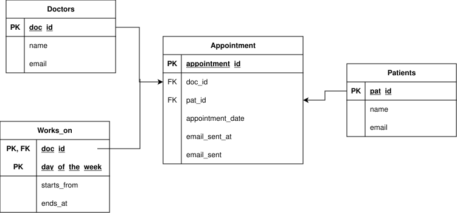

# Mneme - Database

Hosts the PostgreSQL (relational) and MongoDB (document) databases used across the system.

---

## Tech Stack

- **Language/Framework:** Docker
- **Key services:** PostgreSQL 16, MongoDB 7.0

---

## Running with Docker 

```bash
docker-compose up postgres mongo
```

---

## Database Structure

### Relational (PostgreSQL)

PK — bold, FK — underlined

Schema:




---

### Non-Relational (MongoDB)

**Raw transcript**

```js
{
    _id: ObjectId("5effaa5662679b5af2c58829"),
    appointmentId: 123,
    doctor: { id: 1, name: "Doctor Phil" },
    patient: { id: 67, name: "Bad Bunny" },
    transcription: "Full transcription text...",
    createdAt: ISODate("2024-01-15T10:30:00Z")
}
```

**Summary**

```js
{
    _id: ObjectId(),
    appointmentId: 123,
    doctor: { id: 1, name: "Doctor Phil" },
    patient: { id: 67, name: "Bad Bunny" },
    output: "Summarized text of the transcription",
    type: "advice",        // advice | prescription | summary
    createdAt: ISODate("2024-01-15T10:30:00Z"),
    status: "approved"     // pending_review | approved
}
```

**Doctor's note**

```js
{
    _id: ObjectId(),
    appointmentId: 123,
    doctor: { id: 1239134283, name: "dr. Martin Hertz" },
    patient: { id: 67, name: "Bad Bunny" },
    symptoms: "...",
    diagnosis: "iridocyclitis",
    description: "...",
    advice_prescription: "...",
    pdf_url: "/exports/prescriptions/123.pdf",
    created_at: ISODate("2024-01-15T10:50:00Z")
}
```

---

## Environment Variables

| Variable              | Description                  | Example          |
|-----------------------|------------------------------|------------------|
| `POSTGRES_HOST`       | PostgreSQL host              | `magnum-postgres` |
| `POSTGRES_PORT`       | PostgreSQL port              | `5432`           |
| `POSTGRES_DB`         | PostgreSQL database name     | `magnum`         |
| `POSTGRES_USER`       | PostgreSQL username          | `magnum_user`    |
| `POSTGRES_PASSWORD`   | PostgreSQL password          | `changeme`       |
| `MONGO_HOST`          | MongoDB host                 | `magnum-mongo`   |
| `MONGO_PORT`          | MongoDB port                 | `27017`          |
| `MONGO_DB`            | MongoDB database name        | `magnum`         |
| `MONGO_ROOT_USERNAME` | MongoDB root username        | `magnum_user`    |
| `MONGO_ROOT_PASSWORD` | MongoDB root password        | `changeme`       |